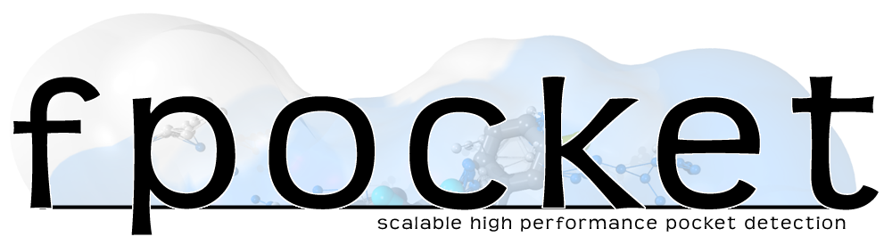

The fpocket suite of programs is a very fast open source protein pocket detection algorithm based on Voronoi tessellation. The platform is suited for the scientific community willing to develop new scoring functions and extract pocket descriptors on a large scale level.

Detailed documentation is available here: [User Manual](doc/MANUAL.md). 
The documentation below here is just a quick & rough overview.

## Content

* fpocket: the original pocket prediction on a single protein structure 
* mdpocket: extension of fpocket to analyse conformational ensembles of proteins (MD trajectories for instance)
* dpocket: extract pocket descriptors
* tpocket: test your pocket scoring function

## What's new compared to fpocket 2.0 (old sourceforge repo)
fpocket: 
- is now able to consider explicit pockets when you want to calculate properties for a known binding site
- cli changed a bit
- pocket flexibility using temperature factors is better considered (less very flexible pockets on very solvent exposed areas)
- druggability score has been reoptimized vs original paper. Yields now slightly better results than the original implementation.
- compiler bug on newer compilers fixed

mdpocket: 
- can now read Gromacs XTC, netcdf and dcd trajectories
- can also read prmtop topologies
- if topology provided, interaction energy grids can be calculated for transient pockets and channels (experimental)


## Getting Started

### Prerequisites

The most recent versions (starting with fpocket 3.0) make use of the molfile plugin from VMD. This plugin is shipped with fpocket. However, now you need to install the netcdf library on your system. This is typically called netcdf-devel or so, depending on you linux distribution.
fpocket needs to be compiled to run on your machine. For this you'll need the gnu c compiler (or another one, but didn't test with others than GCC).
install netcdf-devel on ubuntu type : 
```
sudo apt-get install libnetcdf-dev
```
on a RHEL based distribution something like this should do:
```
sudo yum install netcdf-devel.x86_64
```

### Installing

Download the sources from github via the website or using git clone and then build and deploy fpocket using the following commands.

#### Compiling on Linux

```
git clone https://github.com/Discngine/fpocket.git
cd fpocket
make 
sudo make install
```

#### Compiling on Mac
Install MacPorts https://www.macports.org/ for instance (needed for netcdf install)
```bash
sudo port install netcdf
export LIBRARY_PATH=/opt/local/lib
git clone https://github.com/Discngine/fpocket.git
cd fpocket
make ARCH=MACOSXX86_64
sudo make install
```

### Running fpocket

You can run fpocket using the following command line as an example:
```bash
fpocket -f 1uyd.pdb
```

This will detect all pockets on the input pdb file, named 1uyd.pdb
If you want to get all command line args for fpocket, simply type `fpocket``

### Running mdpocket
To detect all pockets and create a pocket frequency grid on a sample input trajectory in an xtc format for instance you can run: 

```bash
mdpocket --trajectory_file input.xtc --trajectory_format xtc -f topology.pdb
```

## Detailed User Manual

You can access the detailed user manual here * [User Manual](doc/MANUAL.md)

## Contributing

Please read [CONTRIBUTING.md](https://gist.github.com/PurpleBooth/b24679402957c63ec426) for details on our code of conduct, and the process for submitting pull requests to us.

## Authors

* **Peter Schmidtke** - *Initial work* - [pschmidtke](https://github.com/pschmidtke)
* **Vincent Le Guilloux** - *Initial work* - [leguilv](https://github.com/leguilv)


## License

This project is licensed under the MIT License - see the [LICENSE](LICENSE) file for details

