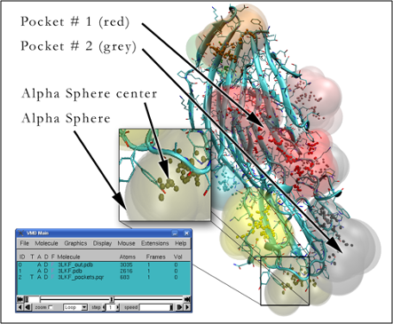
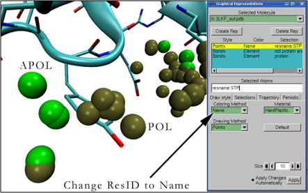
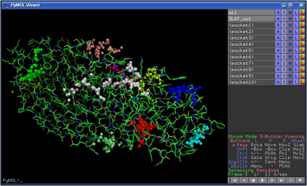
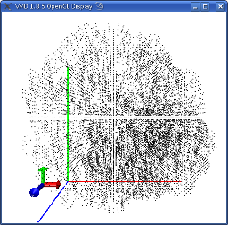
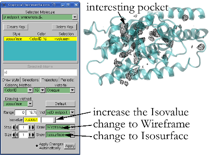
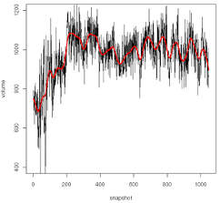
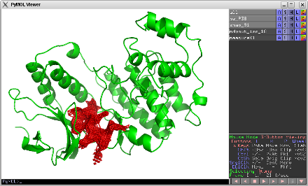

# Getting started & Advanced guides

##### fpocket

* [fpocket basics](#fpocket-simple-pocket-detection)
* [fpocket advanced](#fpocket-advanced)

##### mdpocket

* [mdpocket basics](#mdpocket-pocket-detection-on-md-trajectories)
* [mdpocket advanced](#mdpocket-advanced)

##### dpocket

* [dpocket basics](#dpocket-descriptor-extraction)
* [dpocket advanced](#dpocket-advanced)

##### tpocket

* [tpocket basics](#tpocket-scoring-ranging-and-evaluation)
* [tpocket advanced](#tpocket-advanced)

##### other

* [pocket descriptors](#pocket-descriptors)
* [cofactor definitions](#Cofactor-definition)
* [customizing fpocket/mdpocket](#Customizing-fpocket)


## fpocket - simple pocket detection

To run the following examples, we use several sample input file `data/sample/` directory). 

### Example

Here you have a very simple and straightforward example of how to run fpocket on a single PDB file downloaded from the RCSB PDB. The following command line will execute fpocket on the 1UYD.pdb file situated in the sample directory.

`fpocket -f sample/1UYD.pdb`

It is also possible to run fpocket on a PDBx/mmcif file type, for example :

`fpocket -f sample/2P0R.cif`

It is mandatory to give a PDB input file using the -f flag in command line. If nothing is given, fpocket prints the fpocket usage/help to the screen. fpocket will use standard parameters for the detection of pockets. Fore more information about these parameters see the [advanced fpocket features](#fpocket-advanced).

If fpocket works properly the output on the screen should look like this :
```bash
=========== Pocket hunting begins ==========
=========== Pocket hunting ends ============
```

If you have a look now in the sample directory, you will notice that fpocket created a folder named 1UYD_out/. This folder contains all the output from fpocket, so what you are actually interested in. If you just want to see rapidly the results, go to the 1UYD_out directory and launch the 1UYD_VMD.sh script. This script will launch the VMD molecular visualizer and load the protein with binding site information coming from fpocket.



The illustration above is somehow what you will see if you launch the VMD script. VMD is well suited for representing the volume of alpha spheres and their respective centers. Usually the visual volume information is not of primordial importance, as the larger alpha spheres tend to reach far out of the protein and smaller alpha spheres are not visible because they are recovered by larger ones. As it can be seen within the Main VMD window, the visualization script loads 3 structures, all of them are explained in more detail in the output section of this chapter.

If you had a closer look before on the methodological aspects of this algorithm (we invite you to read the paper) a natural question would be how to represent apolar and polar alpha spheres. Currently the color code represents only the residue ID (rank of the cavity). If you want to see characteristics of alpha spheres we invite you to change the representation of alpha spheres. This can be found by clicking Graphics -> Representations. Another window will show up. There you select the first molecule (1UYD_out.pdb), like represented on the figure below.



A script for fast visualization using PyMOL is also provided. PyMOL provides nice features browsing and selecting different pockets, using the predefined selection patterns on the right side of the main window. However, PyMOL does not interpret well the pqr file format, so alpha sphere volumes are not accurate and only alpha sphere centers can be shown.



### Basic input

#### Mandatory (1 OR 2):

	1: flag -f :    one standard PDB or PDBx/mmcif file name.
	2: flag -F :    one text file containing a simple list of pdb path

#### Optional:
For more details on optional fpocket arguments see [advanced fpocket features](#fpocket-advanced).


### Output
Fpocket output is made of many files. To have a detailed overview of those files, see [advanced fpocket features](#fpocket-advanced).

Is there something else? No, you are done. Congratulations, you have successfully performed your first pocket prediction with fpocket...without any accidents we hope. As you might have seen, usage of fpocket is rather simple, although it is command line based software. Furthermore you should have seen that fpocket is very fast, well, lets say if you do not run it on a P1 100Mhz.
As mentioned before, fpocket provides much more possibilities especially for filtering out unwanted pockets, clustering of alpha spheres. For all these issues and usage of these more advanced features, refer to [advanced fpocket features](#fpocket-advanced)


## mdpocket pocket detection on MD trajectories

The fpocket developer team is proud to present a very new feature as part of the fpocket software package. As programmers are very creative people, as you might know, we called this program mdpocket, as acronym of Molecular Dynamics pocket (very original isn't it?). In the next paragraphs we will refer to Molecular Dynamics as MD.

Well, mdpocket is a freely available software that allows you to do the following very nice things in a quite fast way :

* pocket detection on MD trajectories (I already said this one)
* visualization of transient pockets (oh, will we have all the Pharma people on our back?)
* extraction of pocket descriptors during the MD trajectory (like pocket volume for example)
* get a static image of pocket occurrences during the MD trajectory (this you do not necessarily see the usefulness, but this will become clearer later)
* perform on the fly energy calculations within a detected pocket

If you are already used to run and analyze MD trajectories you know that there is a bunch of different software available to perform calculation and analysis of MD trajectories. Mdpocket is able to read plain PDB files describing the conformations of a protein, but now you can also read Amber crd files, gromacs xtc, netcdf and charmm and Namd dcd files (that was a nightmare to integrate and compile, so please make use of it).

### Example
It is VERY IMPORTANT to first align (superimpose) all snapshots onto each other. Why? Well, you have to do this due to the methodology used behind mdpocket. For more information on how mdpocket works feel free to read the mdpocket paper:
(http://bioinformatics.oxfordjournals.org/content/27/23/3276.long)

Below is an example for Amber for instance, but you can do the same with gromacs tools, mdtraj in python or in VMD analyzing NAMD trajectories for instance:

 With Amber you can do the structural alignment and transformation using the freely available ptraj or cpptraj program and the following steps:

- 1: create a ptraj input file with the following content :

        trajin ../md_1.x.gz 1 250 10
        trajin ../md_2.x.gz 1 250 10
        trajin ../md_3.x.gz 1 250 10
        reference ../reference.pdb
        strip !:1-208
        rms reference :25-88,120-196@CA,C,N,O
        trajout trajectory_superimposed.dcd charmm
        go
- 2: 	Run ptraj using the following command:
`ptraj your_topology.top < ptraj_input_file.ptr`

A few words about what we are doing here. First, the ptraj input reads trajectory files. In this example, the trajectory is split up in 3 files. Each file has 250 snapshots. Here we only read every tenth snapshot of the 250. We set a reference PDB structure for the alignment.

The strip command allows you to drop residues, here everything other than the protein (solvent, counter ions etc...).

Next, we align each snapshot on the reference structure, using only the heavy atoms of residues 25-88 and 120 to 196.

The output is written to trajectory_superimposed.dcd. Here we write a dcd file just for demonstration purposes, you can write mdcrd or netcdf files as well with ptraj.

Now, here we are, we can run mdpocket (finally...):

`mdpocket --trajectory_file trajectory_superimposed.dcd --trajectory_format dcd -f reference.pdb`

NB: you still have to provide a pdb file containing the actual topology of the structure as most of the supported MD formats only store coordinates, but no information on the actual atom & residue types of the structure.

The following part will take a while, depending on the number of atoms in your system and the number of snapshots you analyze. In average on a sample MD of 4000 snapshots (3258 atoms) 0.4 seconds of calculation time were necessary for analysis of 1 snapshot on one core of a 2.66Ghz Intel Quad with 4Gb of RAM.  

Mdpocket will print out some things and the actual status of advance of the calculation. Once finished you will be able to find the following output files in your current folder :

* `mdpout_freq_grid.dx`: This is an output grid file. The grid contains only a measure of frequency of how many times the pocket was open during a MD trajectory. This, averaged by the number of snapshots, gives a range of possible iso-values between 0 and 1. Currently we provide both types of grid files (frequency & density, as both have proven their usefulness during in-house studies. However, the frequency grid file is usually much easier to interpret.
This representation gives you already a lot of information especially about existing paths during a MD. For mechanistic studies this can often be enough, However, if you want to do measurements of the volume (for example) of a certain pocket you have to select this region first. As VMD and the grid file are not really suitable for selection, mdpocket provides two last output files called :

* `mdpout_dens_grid.dx`: This is one of the two grid output files coming from mdpocket. Briefly, a grid is superposed to all alpha spheres of all snapshots and the number of alpha spheres around each grid point is counted. This output is very useful as working file for a first crude visualization using PyMOL or VMD. In the following example we will show VMD as the visualization of grids is easier and less heavy with it. Open VMD and load the DX file. You should have something like this (colors are different) :



Well, this is nice, but you can hardly see anything interpretable in there. In order to see more clearly we recommend to change the representation by going to Graphics -> Representations as shown in the following illustration:



Now you basically can play with the Isovalue slider to get more or less conserved cavities during the MD trajectory. The unit of this isovalue can be expressed as number of Voronoi Vertices (alpha sphere centers) in a 8Å3 cube around each grid point per snapshot. The more a cavity is conserved (or dense) the higher this value. Thus, you will usually get internal pockets and protein internal channels. If you are interested in very superficial or transient binding sites you should decrease the isovalue until you see it.

* `mdpout_dens_iso_8.pdb`: This file contains all grid points having 3 or more Voronoi Vertices in the 8A3 volume around the grid point for each snapshot. Using PyMOL you can now select and save only the grid points of the pocket you are interested in. Save these points to another pdb file. Let us call this file my_pocket.pdb. The choice of the correct grid points for your pocket definition depends completely on you. As rule of a thumb we would recommend to use a high (like 5) isovalue if you want to show open channels in a protein or protein internal binding pockets. You should lower this isovalue (maybe to 2 or 3) if you are interested in transient phenomena (opening, closing of paths, transient pockets etc...). Refer to advanced features to know how to extract these pdb files with other iso values.

* `mdpout_freq_iso_0_5.pdb`: This is similar to the previous pdb file, just being produced on the frequency grid with a cut-off of 0.5.

In order to measure the pocket around your previously defined pocket during the MD trajectory you have to rerun mdpocket in a slightly different way:

`mdpocket --trajectory_file trajectory_superimposed.dcd --trajectory_format dcd -f reference.pdb --selected_pocket my_pocket.pdb`

As you can see, now you have to pass your pocket definition using the --selected_pocket flag of mdpocket. To see how to define your pocket, see the section [Pocket Selection](#pocket-selection). The -v flag is optional, it is just to provide reasonably good volume calculations in a reasonably good execution time. As during the first mdpocket run you should see some output first and the advancement of mdpocket through all you snapshots. Once finished you will find some other output files in your folder:

* `mdpout_mdpocket.pdb`: This is a pdb file that contains all Voronoi vertices in the selected pocket zone for each snapshot. Each snapshot is handled as separated model (like a NMR structure) and can thus be viewed as MD using PyMOL. Show the surface of the vertices and you can visualize the movement of your pocket. Be careful, VMD does not read this file, as from one snapshot to the other a different number and type of Voronoi vertices can be part of the model.

* `mdpout_mdpocket_atoms.pdb`: This is a pdb file similar to the previous output, but this time containing all receptor atoms defining the binding pocket.

* `mdpout_descritpors.txt`: Last but not least, maybe the most important file containing the pocket descriptors. You will find for each snapshot the pocket volume, the number of alpha spheres and all other default fpocket descriptors:

        snapshot 	pock_volume 	nb_AS 	mean_as_ray ...
        1 		793.47 		183 		3.76
        2 		726.95 		158 		3.86
        3 		711.87 		213 		3.59
        4 		700.82 		172 		3.61
        5 		762.24 		196 		3.85
        6 		618.31 		193 		3.77

This output file can be easily analyzed using R, gnuplot or other suitable software. An example R output for the pocket volume would be:



If you want to reproduce this, simply launch R and type:

```R
r=read.table("mdpout_descriptors.txt",h=T)
ylim=c(400,1200)
plot(r[,"pock_volume"],ty='l',ylim=ylim,main="",xlab="",ylab="")
par(new=T)
plot(smooth.spline(r[,"pock_volume"],df=40),col="red",lwd=3,ylim=ylim,ty="l",xlab="snapshot",ylab="volume")
```

On this figure you can see a clear volume increase of the pocket in the beginning of the trajectory. Now you can check to what phenomena this increase is due to by analyzing the mdpout_mdpocket.pdb output  in PyMOL. Not shown in this example, mdpocket now provides also measurements of the polar and apolar surface area (van der Waals + 1.4Å probe) of the pocket.

### Pocket Selection
In order to be able to track some nifty properties of your cavities, like the solvent accessible surface area, the volume or other fpocket descriptors, you have to select the zone you are interested in. This process is crucial and can depply influence sub-sequent results.

But first of all, what is a selected pocket here? Here, this means a PDB file containing dummy atoms at the positions of grid points that overlap with grid points in the pocket grid you calculated in the first run (frequency or density grid). How can you obtain these dummy atoms? This can be done in two different ways.

__The fast way:__ The first, easy and not very accurate way is to use the defaut pdb files coming from the first run of mdpocket to detect the pocket grids. If you read this manual with a huge attention and did not fall asleep in between, then you remember that mdpocket provides two files called `mdpout_freq_iso_0_5.pdb` and `mdpout_dens_8.pdb`. These files contain dummy atoms at grid point positions that were extracted at grid points having a given value or higher (iso-value of 0.5 and 8 respectively). Now you can use one of these files (depending on if you are more comfortable with one or the other grid, and open them in a molecular viewer that is able to edit structures. PyMOL is an excellent choice to perform this task. Simply select all dummy atoms in the zone of interest (your pocket you want to track) and then create an object with this selection. In the end, the result should look somehow like this:



Here the red cloud corresponds to the grid points I have selected by hand. You can now save the grid points that you selected as a PDB file and use this as an input for tracking the properties of the cavity.

__The better way:__ In order to get a good estimate of the volume and extent of the pocket you will notice that the default output pdb files for the two grids are not always sufficient, because of their predefined iso-values. This why you should extract the grid points as a PDB file using your own choice of iso-values. As a general rule, take the iso-values as low as possible. You should still be able to distinguish the different pockets in the density grid, but it's volume should not be very tiny!

You can extract these grid points using a python script that is available in the scripts directory of the fpocket distribution, called `extractIso.py`. Simply execute it with `python extractIso.py` to see how to use it.

### Basic Input
#### Mandatory (running mode 1 - detecting pockets):
##### either: 
    --trajectory_file   : input trajectory file in one of the supported formats
    --trajectory_format : (dcd,xtc,netcdf,crd,crdbox,dtr,trr)
    -f                  : topology of the structure as input PDB file

##### or : 
	-L: a mdpocket input file, this file has to contain the paths to the PDB files of all snapshots (one path per line)

#### Mandatory (running mode 2 - calculating descriptors):
##### either: 

    --trajectory_file   : input trajectory file in one of the supported formats
    --trajectory_format : (dcd,xtc,netcdf,crd,crdbox,dtr,trr)
    -f                  : topology of the structure as input PDB file
    --selected_pocket   : a PDB file containing the sitepoints in the pocket to be selected

##### or : 

	-L: a mdpocket input file, this file has to contain the paths to the PDB files of all snapshots (one path per line)
	--selected_pocket   : a PDB file containing the sitepoints in the pocket to be selected

#### Optional:

	-o : the prefix you want to give to mdpocket output files

Note that mdpocket determines its running mode by the input given by the user. Thus if you do not provide a wanted pocket using the --selected_pocket flag, mdpocket will automatically only perform cavity detection. mdpocket offers much more optional parameters in order to guide the pocket detection. All fpocket parameters for pocket clustering and filtering are also available in mdpocket. For this see [advanced mdpocket features](#mdpocket-advanced).

### Output (running mode 1 - pocket detection)

* `mdpout_dens_grid.dx`: A dx formatted grid output. This grid contains the number of Voronoi vertices seen per snapshot nearby the grid point. It can be easily visualized using VMD.
* `mdpout_freq_grid.dx`: Similar to the prevous file, this grid file contains the frequency of opening of a pocket at each grid point. It can be visualized using VMD.
* `mdpout_dens_iso_8.pdb`: A pdb file of all grid point positions corresponding to grid points having 8 or more Voronoi vertices nearby per snapshot. This file is provided in order to be able to edit the grid points using PyMOL and select only the points defining the pocket of interest. This pocket of interest should be used as input of mdpocket in the 2nd running mode. If you want to extract gridpoints with other isovalues, use the provided `extractISO.py` file in the scripts directory.
* `mdpout_freq_iso_0_5.pdb`: A pdb file of all grid point positions corresponding to grid points that are 50% of the trajectory overlapping with a pocket. This file is provided in order to be able to edit the grid points using PyMOL and select only the points defining the pocket of interest. This pocket of interest should be used as input of mdpocket in the 2nd running mode. If you want to extract gridpoints with other isovalues, use the provided `extractISO.py` file in the scripts directory.

### Output (running mode 2 - pocket characterization)

* `mdpout_mdpocket.pdb`: A pdb file containing all Voronoi vertices within the selected pocket region for all snapshots. This file is an NMR like file, containing each snapshot as 
separated model. This file is best viewed using PyMOL and can be used to create pocket motion movies.

* `mdpout_mdpocket_atoms.pdb`: A pdb file containing all receptor atoms surrounding the selected pocket region. Like the previous output file, this is a NMR like file, containing each snapshot as separated model. This file can be viewed with VMD and PyMOL.

* `mdpout_descriptors.txt`: A text file containing the fpocket pocket descriptors of the selected pocket region for each snapshot. This file can be easily analyzed using standard statistical software like R.

## dpocket descriptor extraction

Until now you have seen what the majority of cavity detection algorithms can do. So a part from speed and hopefully prediction results, nothing distinguishes fpocket from other algorithms like ligsite, sitemap, sitefinder, pocketpicker, pass ...
This is just partially true, because the fpocket package contains dpocket. D is an acronym for describing. One purpose a cavity detection algorithm can be used for is the extraction of descriptors of the physico-chemical environment of the cavity. dpocket allows to do this in a very simple and straightforward way. As extracting binding pocket descriptors on only one protein would be somehow meaningless for studying pocket characteristics, dpocket enables analysis of multiple structures. So now, no longer scripting and automation is necessary to do these kind of things. But lets have a closer look using again a very simple example you can try on your workstation.

### Example 

Here we go. dpocket requires one single input file. This input file must be a text file containing the following information: 
- 1: the PDB file of the protein you want to analyze and 
- 2: the ID of the ligand you would like to have as reference in order to define an explicitly defined binding pocket. The file used in this example (data/sample/test_dpocket.txt) looks like this :

```
data/sample/3LKF.pdb   pc1	
data/sample/1ATP.pdb   atp
data/sample/7TAA.pdb   abc
```

Here we analyze three pdb files. Note that the ligand name should be separated by a tabulation from the pdb file name. You can launch dpocket on this sample file using the following command:

`dpocket -f sample/test_dpocket.txt`

dpocket will yield 3 results files in the current directory. These files will be by default :

    - dpout_explicitp.txt
    - dpout_fpocketnp.txt
    - dpout_fpocketp.txt

If you want to change naming of these files, use the `-o` flag in command line to define a new prefix for the fpocket output files, for example `my_test` as prefix would yield `my_test_explicitp.txt`. The three output files contain the in fpocket implemented pocket descriptors for each binding pocket found by fpocket :

- __fpocketp.txt__:  describes all binding pockets found by fpocket that match one of the detection criteria. In other word, fpocket found several pocket in the protein, and this file will contain descriptors of pocket that are considered to be the binding pocket using some detection criteria.
- __fpocketnp.txt__: describes on the contrary all pockets found by fpocket that are not found to be the actual pocket using the detection criteria.
- __explicitp.txt__: describes the pockets explicitely defined. By explicitely defined here, we mean that the pocket will be defined as all vertices/atoms situated at a given distance of the ligand (4A by default), regardless of what fpocket found during the algorithm.


The ouput files are tab separated ASCII text files that are easy to parse using statistical software such as R. Thus statistical analysis of pocket descriptors becomes a very straightforward and easy process. Basically, the two first files might be used to establish a new scoring function as they describe what fpocket finds, while the last file could be used for a more detailed and accurate analysis of the exact part of the protein that interact with the ligand.
For more details of the output refer to the output section below, or to [advanced dpocket features](#dpocket-advanced).


### Basic input

#### Mandatory:

	flag -f : a dpocket input file, this file  has to contain the path to the PDB file, as well as the residuename of the reference ligand, separated by tabulation.

#### Optional:

	flag -o : the prefix you want to give to dpocket output files
dpocket offers much more optional parameters in order to guide the pocket detection. For this see Advanced features chapter – [advanced dpocket features](#dpocket-advanced).

### Output

Refer to [advanced dpocket features](#dpocket-advanced) for a detailed description of the dpocket output files. 

In conclusion of this first very easy dpocket run, you can see that you have a very fast and reliable tool to extract pocket descriptors, of binding pockets and “non binding pockets” on a large scale level. These descriptor files provide an excellent tool for further statistical analysis and model building, which leads immediately to your wish to write a new scoring function for ranking pockets using the different descriptors. Well, fpocket, dpocket and tpocket are very useful tools to do exactly this! So go ahead. Lets suppose you have passed several thousands of PDB files and analyzed statistically the significance of all descriptors. You have set up a new scoring function. Now you have an external test set of PDB files you haven't tested. How can you evaluate your scoring function? This is actually also a very easy task, using tpocket.


## tpocket scoring ranging and evaluation

As already mentioned in the previous paragraph, tpocket can be used in order to evaluate rapidly cavity scoring functions. If you are for example in the pharmaceutical industry and you want to set up the ultimate drugability prediction score, you might be able to do this with fpocket and dpocket. Afterwards you can actually test your method using tpocket. T is an acronym for testing, here. 

Something fancy we did not tell you about before is that you can also test your scoring function on apo structures using tpocket. The only requirement is the need to align holo and apo structure to obtain superposed apo and holo pockets. But lets explain this with an example. Of course, testing a holo dataset is even more easy, you just need to provide the resname of the ligand and tpocket will do the rest.

### Example – tpocket on apo structures

If you had a look to the fpocket paper, you might have seen that the algorithm was validated on a dataset of 48 proteins previously used to evaluate several pocket detection algorithms. As fpocket programmers are, by definition, very nice people, they have included this data set (holo and aligned apo structures) in the distribution of fpocket, released as `fpocket-1.0-data` with the original fpocket 1 release. [The tar.gz is available on sourceforge](https://sourceforge.net/projects/fpocket/files/fpocket-1.0/fpocket-src-1.0/fpocket-data-1.0.tgz/download)

So let us use this set as example here. When you extract the dataset in your folder you should have a data folder containing among others two files, `pp_apo-t.txt` and `pp_cplx-t.txt`. The first file is a tpocket input file in order to assess the capacity of the scoring function to rank correctly known binding sites on apo structures. The second file is also a tpocket inputfile, but this time for known binding sites on holo structures. Here is a part of `pp_apo-t.txt`:

    data/pp_data/unbound/1QIF-1ACJ.pdb      data/pp_data/complex/1ACJ.pdb   tha
    data/pp_data/unbound/3APP-1APU.pdb      data/pp_data/complex/1APU.pdb   iva
    data/pp_data/unbound/1HSI-1IDA.pdb      data/pp_data/complex/1IDA.pdb   qnd
    data/pp_data/unbound/1PSN-1PSO.pdb      data/pp_data/complex/1PSO.pdb   iva
    data/pp_data/unbound/1L3F-2TMN.pdb      data/pp_data/complex/2TMN.pdb   po3
    data/pp_data/unbound/3TMS-1BID.pdb      data/pp_data/complex/1BID.pdb   UMP
    data/pp_data/unbound/8ADH-1CDO.pdb      data/pp_data/complex/1CDO.pdb   NAD
    data/pp_data/unbound/1HXF-1DWD.pdb      data/pp_data/complex/1DWD.pdb   MID

Here the first column contains the path to the apo structure, aligned to the holo structure, which is given in the second column. Using a holo dataset, the first and the second column would be the same. The third column indicates the PDB HETATM code of the ligand in the holo structure that is situated in the binding site.

You can use this file to run tpocket using the following command line :

`tpocket -L data/pp_apo-t.txt`

Let us continue with the more interesting case, the first example, with a lot of structures. After some time of calculation, tpocket will provide two standard output files. The moment has come, you will finally know if you discovered the ultimate method of drugability prediction, or sugar binding site prediction or whatever. The first file is called by default `stats_g.txt`. It contains global statistics about the prediction using all evaluation criterias available in tpocket, so for example how many binding sites you found among the 3 first ranked cavities. For representational purposes only the first of the six tables available in this file is depicted hereafter:

    Ratio of good predictions (dist = 4A)
    -------------------------------------
    Rank <=  1  :		  0.69
    Rank <=  2  :		  0.83
    Rank <=  3  :		  0.94
    Rank <=  4  :		  0.94
    Rank <=  5  :		  0.94
    Rank <=  6  :		  0.94
    Rank <=  7  :		  0.94
    Rank <=  8  :		  0.94
    Rank <=  9  :		  0.94
    Rank <= 10  :		  0.94
    -------------------------------------
    Mean distance          : 2.924573
    Mean relative overlap  : 39.373226

This table schedules the capacity of your scoring function to identify the binding sites of the 48 apo structures using the criteria published within the original pocket picker paper. Not represented here, tpocket provides two other, maybe more accurate, measures for a correctly identified binding site. These measures are explained in more detail in the [advanced tpocket features section](#tpocket-advanced), as they can be a bit more tricky.

The second output file provides more accurate statistics about each structure analyzed. This file, called `stats_p.txt` enables the user to analyze more closely why scoring might not work well on a specific structure. Here is an extract of the first columns and lines of this file:

    LIG | COMPLEXE | APO | NB_PCK | OVLP1 | OVLP2 | DIST_CM | POS1 | POS2 | POS3
    THA 1ACJ.pdb 1QIF-1ACJ.pdb    22   79.31   78.33    0.00    1    1    0
    IVA 1APU.pdb 3APP-1APU.pdb     4    0.00    0.00    3.43    0    0    1
    QND 1IDA.pdb 1HSI-1IDA.pdb     4   82.69   81.65    3.19    1    1    1
    IVA 1PSO.pdb 1PSN-1PSO.pdb     9   80.00   51.38    3.49    1    1    1
    PO3 2TMN.pdb 1L3F-2TMN.pdb    10   58.33   72.00    2.69    1    1    1
    UMP 1BID.pdb 3TMS-1BID.pdb    15   63.64   60.78    3.52    1    1    1
    NAD 1CDO.pdb 8ADH-1CDO.pdb    18    0.00    0.00    3.41    0    0    1
    MID 1DWD.pdb 1HXF-1DWD.pdb    10   93.48   81.37    3.86    1    1    1

Using this output you have a detailed view of what worked and what did not worked for all criteria. For instance, in this example, fpocket detects well all apo binding sites a part from the first one using the PocketPicker criterion for binding site identification (DIST_CM). POS3 corresponds to the rank  of the cavity using the scoring function of fpocket. You have further information about the number of pockets per protein and the exact overlap with the actual pocket.

Now if you want to assess your scoring function on holo structures, you also can use tpocket. This time you only have to provide the `pp_cplx.txt`, also provided within the sample tar.gz file. As you can see, this file is very similar to `pp_apo.txt`. Only the first column repeats the path to the complex structure like this:

    data/pp_data/complex/1acj.pdb   data/pp_data/complex/1acj.pdb   tha
    data/pp_data/complex/1apu.pdb   data/pp_data/complex/1apu.pdb   iva
    data/pp_data/complex/1ida.pdb   data/pp_data/complex/1ida.pdb   qnd
    data/pp_data/complex/1pso.pdb   data/pp_data/complex/1pso.pdb   iva
    data/pp_data/complex/2tmn.pdb   data/pp_data/complex/2tmn.pdb   po3
    data/pp_data/complex/1bid.pdb   data/pp_data/complex/1bid.pdb   ump
    data/pp_data/complex/1cdo.pdb   data/pp_data/complex/1cdo.pdb   nad

### Basic Input

#### Mandatory:

	flag -L : a tpocket input file, this file  has to contain the paths to the PDB files (apo, holo or holo,holo if you want to test fpocket only on holo structures), as well as the residuename of the reference ligand, separated by tabulation.

#### Optional:
	flag -o : the prefix you want to give to tpocket detailed statistics
	flag -e : the prefix you want to give to tpocket general statistics

tpocket offers much more optional parameters in order to guide the pocket detection. For this see the [advanced tpocket features section](#tpocket-advanced).

### Output
Using standard parameters on the example tpocket list given in the example paragraph above, tpocket returns two output files:

* `stats_p.txt`: This file contains the detailed statistics of tpocket. The name and the ligand of the analyzed PDB structure are repeated, as well as the exact overlap of the fpocket identified binding pocket with the actual binding pocket (identified with the help of the ligand, called OVLP here). You will see two different overlaps in the output. For further informations refer to the  [advanced tpocket features section](#tpocket-advanced). Furthermore, the distance criterion used in the Chemistry Central Journal paper for publication of PocketPicker was used (DIST_CM). Next, you can also have exact information about the rank of the cavity using the fpocket scoring function.
* `sats_g.txt`: Second, tpocket provides more general statistics about pocket identification on the dataset provided. For both overlap criterions the ranking performance (the capacity of the fpocket scoring to rank correctly a binding site having a certain minimum overlap with the actual binding site) is printed into this file. Thus, statistics in this file gives you a rapid overview over the global performance of your method.

Summarizing features of tpocket, one could retain, that tpocket is a very fast way to test fpockets performance on your own dataset and test your own scoring functions for ranking purposes of identified binding sites.

You have finished the Getting started section. We hope that you notice the usefulness (hopefully;) of this package of programs for the research of new features, descriptors and scoring functions in the binding site identification field. Well, this was only a very fast overview over the very basic features of fpocket, dpocket and tpocket. If you want to dive into development of your own pocket descriptors and scoring functions, or if you want to change the pocket detection parameters for your purposes, continue with the Advanced features section, next.


# Advanced Features

You want to know more about fpocket? This is the section for you, here we tried to compile in a (we hope) comprehensive manner the most important details of fpocket, dpocket and tpocket, to which you have access by command line. It is primordial to know, that fpockets performance was assessed and scoring function was established for standard parameters. The performance of pocket detection and scoring is highly dependent on these parameters, so keep in mind that you might have to adapt scoring to your specific problem.
Note that this section does not provide too much information about the theoretical background of the way fpocket works. In order to learn more about this read the Materials & Methods of the [freely available paper on the BMC Bioinformatics](https://bmcbioinformatics.biomedcentral.com/articles/10.1186/1471-2105-10-168) website. Nevertheless, we tried to keep it as clear as possible, using some application examples.

## fpocket advanced

### Input command line arguments

#### Mandatory:
The simplest way to run fpocket is either by providing a single pdb file, or by providing a list of pdb file, stored in a simple text file. You will need one of these two input to run fpocket:

    -f string : one standard PDB filename that you want to analyze with fpocket
##### or:
    -F string : filename of a simple list of pdb files.


#### Optional:

    -m float: (default 3.4Å) This flag enables the user to modify the minimum radius an alpha sphere might have in a binding pocket. An alpha sphere is a contact sphere, that touches 4 atoms in 3D space without having any internal atoms. Here 3Å allow filtering of too small (protein internal) alpha spheres. If you want to analyze internal interstices, lower this parameter. In the contrary, if you want to analyze more solvent exposed cavities, you can raise this parameter in order to filter out too buried cavities.
    
    -M float: (default 6.2Å) Here you can modify the maximum radius of alpha spheres in a pocket. An alpha sphere is a contact sphere, that touches 4 atoms in 3D space without having any internal atoms. Here 7Å allow to filter out too large contact spheres, that are lying on the protein surface. If you want to analyze very flat and solvent exposed surface depressions, raise this parameter. For analysis of buried parts of the protein you can lower this parameter. Higher radii might be more interesting for identification of protein protein binding sites or polysaccharide binding sites. Smaller radii enable detection of buried cavities for small organic molecules (drugs, for instance).
    
    -l int: (None) If you have an input PDB file of an NMR structure or one with multiple models you can specify which model (conformation) you'd like to analyse
    
    -C char: (default s) The clustering method to be used here. By default a pairwise single linkage clustering is used here. 
        's': pairwise single linkage clustering,
        'm': pairwise maximum- (or complete-) linkage clustering, 
        'a': pairwise average-linkage clustering, 
        'c': pairwise centroid-linkage clustering
    
    -e char: (default e) The distance measure used for the clustering algorithm. 
        'e': Euclidean distance
        'b': City-block distance
        'c': correlation
        'a': absolute value of the correlation
        'u': uncentered correlation
        'x': absolute uncentered correlation
        's': Spearman's rank correlation
        'k': Kendall's tau
    
    -i int: (default 15) This flag indicates how many alpha spheres a pocket must contain at least in order to figure in the results provided by fpocket. This parameter enables filtering of too small cavities. Thus, if you want to analyze smaller cavities also, lower this parameter, if you are only interested in huge cavities, like NADP binding sites, you can raise it in order to retain only very few pockets in the end. To give you an idea, a rather big cavity, like a NADP binding site, can have hundreds of alpha spheres. Thus, 30 as standard parameter enables also to keep smaller binding sites.
    
    -A int: (default 3) Fpocket distinguishes between two types of alpha spheres. Polar alpha spheres and apolar alpha spheres. This flag ranges from 0 to 4 and modifies the definition of the alpha sphere type. By default, an alpha sphere contacting at least 3 apolar atoms (having an electronegativity below 2.8) is considered as apolar. If this is not the case it is considered as polar.
    
    -D float: (default 2.4Å) this parameter changed compared to the previous versions of fpocket as we completely replaced the clustering algorithms entirely. This measure is now used to analyze a hierarchical distance and cut sub-trees at the desired distance. The bigger the distance, the larger the clusters you'll get. 
    
    -p float: (default 0.0) This is another parameter for filtering unwanted pockets. It defines the maximum ratio of apolar alpha spheres and the number of alpha spheres in a pocket in order to keep the pocket in the results list. That is to say, by default every pocket is kept (0.0). Now, if you would like to filter rather hydrophobic pockets, raise this parameter and very polar cavities will be filtered out. This parameter is a ratio, not a percentage, thus it ranges from 0 to 1.
    
    -v int: (default 2500) By default, pockets volume are calculated using a monte-carlo algorithm. Basically, the algorithm picks a random point in the space and check if it is included in any alpha sphere, and stores this status. This is repeated N times, and we estimate the volume of the pocket using ratio between the number of hit and the number of iteration, scaled by the size of the box. This parameter defines the number of iteration to perform. Of course, the higher the value is, the greater the accuracy will be, but the performance will be slowed down.
    
    -b (none): (NOT USED BY DEFAULT) This option allows the user to choose a discrete algorithm  to calculate  the  volume of each pocket instead of the Monte Carlo method. This algorithm puts each pocket into a grid of dimension (1/N*X  ;  1/N*Y  ;  1/N*Z),  N being the value given using this option, and X, Y and Z being the box dimensions,  determined using coordinates of vertices. Then, a triple iteration on each dimensions is used to estimate the volume, checking if each points  given  by the iteration is in one of the pocket’s vertices. This parameter defines the grid discretization. If this parameter is used, this algorithm will be used instead of the Monte Carlo algorithm. 
    Warning: Although this algorithm could be more accurate, a high value might dramatically slow down the program, as this algorithm has a maximum complexity of N*N*N*nb_vertices, and a minimum of N*N*N !!!

    -d (none): Option allowing you to output pockets and properties in a condensed format. This will put to the stdout pocket properties in a tab separated string and write pocket files in a subfolder
    
    -r string: (None) This parameter allows you to run fpocket in a restricted mode. Let's suppose you have a very shallow or large pocket with a ligand inside and the automatic pocket prediction always splits up you pocket or you have only a part of the pocket found. Specifying your ligand residue with -r allows you to detect and characterize you ligand binding site explicitly. For instance for `1UYD.pdb` you can specify `-r 1224:PU8:A` (residue number of the ligand: residue name of the ligand: chain of the ligand)

    -P string: (None) Binding site delimited by the user through the input. You can inidcate which amino-acids are part of the binding site you'd like to "identify" and calculate descriptors for. fpocket will run its usual alpha-sphere detection and clustering will be guided to collect all alpha spheres in contact with residues of interest. You should enter a string of residues with residue numbers, insertion codes & chain codes: 'residuenumber1:insertioncode1:chaincode1.residuenumber2:insertioncode2:chaincode2.residuenumber3:insertioncode3:chaincode3'. Insertion codes can be empty. `-P 107::A.138::A.51::A.98::A.55::A.93::A` for instance for part of the HSP90 binding site of 4cwr. NB: If you use an mmcif file as input, you need to use the automatically assigned residue number instead of author defined number for this to work.
    
    -y string: (filename) EXPERIMENTAL: here you can specify a topology filename in the Amber prmtop format. This can then be used by fpocket & mdpocket to calculate energy grids for your pockets. NB: you have to specify the -x flag to run energy calculations
    
    -x None: (None) EXPERIMENTAL: specify this flag if you want to run energy calculations on calculated pockets. That's not fully functional and only one or two probes are currently generated and output density grids written. Use with caution
    
    -c char : (Default is none): Use this flag to choose which chains you want to delete before running fpocket. The selected chains can be specified with ',' or ':' delimiters, for example you can use it '-c B,D' or '-c B:D'. You can delete up to 20 different chains.
    
    -k char : (Default is none): Use this flag to choose which chains you want to keep before running fpocket. The selected chains can be specified with ',' or ':' delimiters, for example you can use it '-k A,B,E' or '-k A:B:E'. You can keep up to 20 different chains.
    
    -a char : (Default is none): With this flag you can select a chain you want to be considered as a ligand. Works the same way as the "-r" flag but with a whole chain. Only a single chain can be chosen, for example '-a D'.
    
    -w char : (Default is 'd') : With this flag you are able to choose what kind of writing file output you want, 'd' -> default (same format outpout as input)| 'b' or "both"-> both pdb and mmcif | 'p' or "pdb"-> pdb | 'm' or "cif" or "mmcif" -> mmcif, for example "-w cif" or "-w p"


###  Output files description

fpocket yields output directly in the directory of the data file, creating a directory using the name of the PDB file followed bu the _out extension. Here, the command ll sample/3LKF_out of the current sample run would look something like this:

        total 332
        -rw-r--r-- 1 peter users    769 Nov 29 00:14 3LKF.pml
        -rw-r--r-- 1 peter users    698 Nov 29 00:14 3LKF.tcl
        -rwxr-xr-x 1 peter users     30 Nov 29 00:14 3LKF_PYMOL.sh
        -rwxr-xr-x 1 peter users     41 Nov 29 00:14 3LKF_VMD.sh
        -rw-r--r-- 1 peter users 245835 Nov 29 00:14 3LKF_out.pdb
        -rw-r--r-- 1 peter users   6725 Nov 29 00:14 3LKF_pockets.info
        -rw-r--r-- 1 peter users  49355 Nov 29 00:14 3LKF_pockets.pqr
        -rw-r--r-- 1 peter users   4073 Nov 29 00:14 3LKF_info.txt
        drwxr-xr-x 2 peter users   4096 Nov 29 00:14 pockets

As you can see, fpocket provides a lot of files and another subdirectory. However, majority of these files are necessary for easy visualization of binding pockets. Lets explain the content and utility of each file:

* `3LKF_info.txt`: this file contains human readable information (descriptors) about the pockets found on the protein. Notably this file contains a pocket score (likeliness this is a small molecule binding site) and a druggability score (how druggable the binding site is) Here an extract:
    Pocket 1 :
            Score :         0.490
            Druggability Score :    0.019
            Number of Alpha Spheres :       21
            Total SASA :    19.687
            Polar SASA :    7.611
            Apolar SASA :   12.076
            Volume :        270.934
            Mean local hydrophobic density :        3.000
            Mean alpha sphere radius :      3.816
            Mean alp. sph. solvent access :         0.519
            Apolar alpha sphere proportion :        0.190
            Hydrophobicity score:   23.889
            ...

* `3LKF.pml`: this is a PyMOL script for visualization of binding pockets using PyMOL
* `3LKF.tcl`: this a tcl script for visualization of binding pockets using VMD
* `3LKF_PYMOL.sh`: this is the executable script to launch fast visualization using PYMOL
* `3LKF_VMD.sh`: this is the executable script to launch fast visualization using VMD
* `3LKF_out.pdb`: this is the most important file, it contains the initial PDB structure given as input. Non cofactor HETATM occurrences will be stripped off in this file compared to the original PDB input file. The PDB file contains centers of alpha spheres using the HETATM definition as dummy atoms. These alpha sphere centers are attached in the end of the PDB file, using the STP residue name (for site point). Apolar alpha spheres carry the atom name APOL, polar alpha spheres the atom name POL. Pockets are sets of alpha spheres. They can be distinguished by residue number. Thus residue STP 1 would be the first binding pocket according to fpocket. To show this more clearly here is an extract of the `3LKF_out.pdb`:
        
        ATOM   2349   CD LYS A 299       9.679  16.827 105.636  0.00  0.00           C 0
        ATOM   2350   CE LYS A 299      10.371  16.314 104.370  0.00  0.00           C 0
        ATOM   2351   NZ LYS A 299      11.749  15.794 104.597  0.00  0.00           N 0
        ATOM   2352  OXT LYS A 299       5.240  20.009 107.670  0.58  9.64           O 0
        HETATM    1 APOL STP C   1      27.849  33.435 123.906  0.00  0.00          Ve  
        HETATM    2 APOL STP C   1      29.108  33.195 122.206  0.00  0.00          Ve  
        HETATM    3 APOL STP C   1      28.611  33.141 119.797  0.00  0.00          Ve  
        HETATM    4 APOL STP C   1      26.830  32.143 118.779  0.00  0.00          Ve  

* `3LKF_pockets.pqr`: This file contains all alpha sphere centers, as the 3LKF_out.pdb file, but contains no information about the protein structure. Furthermore using the pqr format enables writing of the van der Waals radius of atoms explicitely in this file. Here this possibility was used to output the radii of alpha spheres of a pocket. Charging this pqr file, one can analyze more precisely the volume recognized by fpocket. Note that, currently only VMD supports reading this format correctly. PyMOL is able to read pqr file, but does not interpret van der Waals radii.    

* `pockets/`: Well, again a subdirectory. But I promise, it's the last one. For development purposes or easy analysis, fpocket proposes this directory which contains according to the current example:

        pocket0_atm.pdb   pocket2_vert.pqr  pocket5_atm.pdb   pocket7_vert.pqr
        pocket0_vert.pqr  pocket3_atm.pdb   pocket5_vert.pqr  pocket8_atm.pdb
        pocket1_atm.pdb   pocket3_vert.pqr  pocket6_atm.pdb   pocket8_vert.pqr
        pocket1_vert.pqr  pocket4_atm.pdb   pocket6_vert.pqr  pocket9_atm.pdb
        pocket2_atm.pdb   pocket4_vert.pqr  pocket7_atm.pdb   pocket9_vert.pqr

* `*_atm.pdb`: These files contain only the atoms contacted by alpha spheres in the given pocket. Complementary to this information, `*_vert.pqr` files contain only the centers and radii of alpha spheres within the respective pocket. As extensions mention, atoms are output in the PDB file format and alpha sphere centers in the PQR file format.

### A word on druggability

With the [Understanding Druggability paper](https://pubs.acs.org/doi/abs/10.1021/jm100574m) we introduced an alternative scoring function in fpocket allowing you to assess the likelihood of a binding site to bind small druglike molecules. Since the publication the score has been retrained and performance improved (no paper for that work out). Roughly, if you get a druggability score of 0 or close to 0 it's predicted no-druggable with drug like molecules. If the score is above 0.5 there might be a chance to find drug-like molecules.
The druggability assessment is done using some of the pocket descriptors extracted by fpocket. IT DOES BY NO MEANS indicate that no molecule binds to a pocket. I.E. a peptide binding site will bind peptides, but peptides won't necessarily be considered as drug-like molecules. 

## mdpocket advanced

A lot of the functionality of mdpocket has already been covered in the Getting started section. However, there is at least one little functionality that you can access via mdpocket that you don't know about yet.

### Detect transient druggable binding pockets

The current version of fpocket contains two scoring methods to score the pockets. The first one is the original fpocket score, published in the first release and the scientific paper. Later, a second pocket score was added. This score, called druggability score intends to assess at what point the identified pocket is likely to bind drug like molecules. This drug score is a value between 0 and 1, 0 signifying that the pocket is likely to not bind a drug like molecule and 1, that it is very likely to bind the latter. In combination with mdpocket the drug score can be of use when someone wants to assess if during a MD trajectory somewhere “druggable” pockets appear. You can do this during the first explorative mdpocket run (without studying a particular pocket), by specifying the `-S` flag in command line when calling mdpocket. This flag will yield mdpocket not to do the following thing: For each snapshot fpocket is run normally and a druggability score is associated to each pocket. Voronoi vertices near to grid points are used to map the drug score to each grid point (instead of counting them, we increment by the drug score of the pocket). We thus recommend to analyze the frequency grid when running mdpocket with `-S`. You will immediately notice that much less pockets are found in the grid at higher iso-values. This can also help to focus initially on your drug binding site (if you are coming from big pharma), especially for the tedious pocket selection by hand, this is very handy.

If you want to draw conclusions about the “mean druggability” of some pockets using the frequency grid you should beware of the fact, that the mean drug score that you see there (the iso-value) is very underestimated compared to values you obtain on crystal structures.

Last, but very important : if you plan to run a mdpocket calculation using `-S`, you should use the fpocket default pocket detection parameters. Using different parameters, like for channels etc makes strictly no sense as the druggability score was trained using the default fpocket parameters.

### Detect different types of pockets

Fpocket was initially created to detect small molecule binding sites on proteins. That is what most people are interested in (a big assumption, we know). But as we want to please a maximum number of you, distinguished fpocket users, we try to keep fpocket as flexible as possible via these various (probably a bit opaque) command line arguments. These arguments become very interesting when one is interested in a different type of pocket detection. For instance, detecting channels and gaz pathways in a protein is a completely different topic compared to finding drug binding sites.

If one wants to identify transient internal pockets and channels one could modify the pocket detection parameters for fpocket / mdpocket. Here we give examples of typical parameters and what type of pockets you are likely to get back from fpocket / mdpocket :

__Detect small molecule binding sites__ : Use the default parameters (don't specify anything)

__Detect putative channels and small cavities__ : -m 2.8 -M 5.5 -i 3 

__Detect pockets where sterically water binding is possible__ : -m 3.5 -M 5.5 -i 3 

__Detect rather big, external pockets__ : -m 3.5 -M 10.0 -i 3

### Additional scripts

In order to facilitate some simple tasks for conversion, extraction and creation of input files the fpocket distribution contains some additional python scripts that can be of use for some specific tasks but do not have anything to do in a concrete way with the pocket detection itself. This is why they are not included as standalone program here.

* `createMDPocketInputFile.py`: This is a standard python script (that should work out of the box on all machines having python installed on it) that takes the path of all the snapshot PDB files of a MD trajectory as input and creates a valid mdpocket input file (alpha numerically sorted list of paths). We recommend you to use this script if you need a valid mdpocket input file without worrying about how to order in a alphanumeric way your file names to form a valid list.

* `extractISO.py`: This is a python script that makes use of the numpy library. If you do not have numpy installed this will not work. However installing numpy is a rather good idea as this is a very nice library ;). The script takes as input a mdpocket dx grid file, a filename (the one you want for the output) and a wanted isvalue. The script will write all grid point coordinates from the dx file having a grid value higher or equal than the wanted isovalue to the output file.


## dpocket advanced

Input command line arguments

### Mandatory:

    -f : a dpocket input file, this file has to contain the path to the PDB file, as well as the residuename (PDB HET residue tag, like “hem”, for heme) of the reference ligand, separated by a tabulation. 

See the [Getting started section of dpocket](#dpocket-descriptor-extraction) for an example of such a file.

### Optional:

    -o : (default dpout) the prefix you want to give to dpocket output files. The standard will produce three output files named dpout_fpocketnp.txt, dpout_fpocketp.txt, dpout_explicitp.txt.
    
    -e : Use the first explicit interface definition (default): we define  the explicit pocket  as  being  all  atoms  contacted  by  alpha spheres situated at a distance of d A° from any ligand atom.
    
    -E : Use  the  second  explicit  interface  definition: we define the explicit pocket as being all atoms situated at a distance  of  d A° from any ligand atom.
    
    -d : The distance criteria used for the explicit pocket definition.
    Last, all optional parameters used by fpocket are also accessible on command line through dpocket. Refer to the preceding paragraph to see details about fpocket parameters.

### Output files description

As shown in the example, dpocket creates 3 output files. Lets describe them a bit more in detail here:

* `dpout_explicitp.txt`: This file contains all pocket descriptors implemented in fpocket of the explicitly defined binding pocket. What does this mean, explicitly? In the input you have associated a ligand identification to each PDB file. This ligand is used by fpocket in order to identify the actual binding pocket. 

        pdb ligand overlap lig_vol pocket_vol nb_alpha_spheres mean_asph_ray
        data/3LKF.pdb PC 100.00   132.90  1678.64    29  3.94
        data/1ATP.pdb ATP 100.00   322.62  2127.53    65  3.59
        data/7TAA.pdb ABC 100.00   608.66  4977.48    97  4.20

Note that this is only an extract of this file. It contains a lot of columns (descriptors) that are not represented here. The first line describes the nature of the entry. The next line recapitulates the pdb structure analyzed (`data/sample/3LKF.pdb`), the ligand used as reference (PC). Next the overlap between the actual and found binding pocket is shown, here 100% as this is an explicitly defined binding pocket. The next entries can be used as descriptors, like the ligand volume, the pocket volume, the number of alpha spheres in the binding pocket, the mean alpha sphere radius ... For a complete list of all implemented descriptors in fpocket, refer to the Advanced features – [Pocket descriptors section](#pocket-descriptors).

The volumes calculated here are not accurate at all. If you want to calculate accurate volumes you have to change parameters for volume calculation. As volume calculations are generally over-estimated using alpha sphere approaches, especially for open binding pockets, this calculation is made available, but uses the minimum sampling for the calculation. For more accurate calculation significantly more calculation time would be necessary. You can provide a higher sampling via the `-v` flag in the command line.

* `dpout_fpocketnp.txt`: This file contains the same kind of descriptors as the preceding one, but this time for pockets identified by fpocket, that are “non binding pockets”. Non binding pockets means here, that the pockets do not correspond to the pocket where the reference ligand binds. Be careful, this does not necessarily mean that other pockets do not bind anything.

* `dpout_fpocketp.txt`: The last file is also formated the same way as the preceding both. This file contains the binding pocket, this time identified by fpocket and not explicitly by the ligand.

## tpocket advanced

This program of the fpocket package is certainly very useful for testing new scoring methods rapidly on a large dataset of protein ligand complexes. However one might encounter difficulties to understand results, interest, advantages and drawbacks of this methodology. In order to facilitate your understanding of this package we provide some more fundamental information first, before treating more practical questions about tpocket.

### Input command line arguments

#### Mandatory:

    -L : a tpocket input file. This file has to contain the paths to the PDB files (apo, holo or holo,holo if you want to test fpocket only on holo structures), as well as the residuename (PDB HET residue tag, like “hem” for heme) of the reference ligand, separated by tabulations.

#### Optional:
	-o : (default ./stats_p.txt) The filename you want to give to tpocket detailed statistics.
	-e : (default ./stats_g.txt) The filename you want to give to tpocket global statistics.
	-d : Distance  criteria used for one of the 3 definition of a pocket: All atoms situated at a distance lower of equal that d will be  considered as part of the actual pocket.
	-k : Keep fpocket output for each pdb test.

Last, all optional parameters used by fpocket are also accessible on command line through tpocket. Refer to [fpocket advanced](#fpocket-advanced) for fpocket parameters.

### Actual pocket definition for evaluation of fpocket

Delimiting, and more generally defining what is the exact binding pocket of a protein in an automated way is not that easy. Finding a criteria that evaluate correctly the ability of fpocket to detect the actual binding site of a protein is consequently even more difficult.  

Tpocket makes use of 6 different ways to determine if a pocket found by fpocket could be considered as the actual binding pocket, with respect to a given ligand:

*	1 – The actual binding site is reduced to a single point, the barycenter of the pocket (calculated using alpha spheres). The binding pocket is defined as the pocket which barycenter is situated at a distance of 4A of any ligand atom. It corresponds to the Ppc discussed in the paper.

*	2 – The actual binding pocket is defined by the set of atoms that are in contact with alpha sphere that are nearby (< 3A) the actual ligand. This set of atoms is then compared to all atoms contacted by all voronoi vertices included in each pocket found by fpocket. WARNING: this is currently not safely usable for an holo/apo dataset.

*	3 – The actual binding pocket is defined by the set of atoms that are nearby (4A) the actual ligand. The same procedure as for the first definition is then applied to say whether a pocket can be considered as the actual pocket or not. WARNING: this is currently not safely usable for an holo/apo dataset.

*	4 – The actual binding pocket is defined by the set of alpha sphere nearby (< 3A) the actual ligand. Then, for a given pocket, we calculate the correspondence between alpha sphere in the pocket, and alpha sphere in the actual binding pocket. If this ratio exceed a certain value (25%), we consider this pocket as being the actual pocket.

*	5 – For a given pocket, we calculate the proportion of ligand atom that are nearby (< 3A) at least one alpha sphere of pocket. If this proportion exceed a certain value (50%), we consider this pocket as being the actual pocket.

*	6 – A combination of both 5th and 6th criteria described above. If both 4th and 5th criterion are satisfied, then this criteria is. This corresponds to the MOc (Mutual Overlap criterion) discussed in the paper.

The reason why we choose 3A for the criteria 2, 4 and 5 is quite simple: as in the current algorithm, the minimum radius of an alpha sphere is 3A, a ligand atom situated at a distance lower or equal than this value can be considered as included in this alpha sphere, and therefore detected. Of course, this applies to alpha sphere with higher radius too.

All of these criteria have their strengths and witnesses, that's why we choose to implement all of them.


## Pocket descriptors

In order to discriminate an interesting pocket from a lot of uninteresting ones, fpocket uses descriptors for each pocket. A scoring function, using these descriptors, was trained to well identify what we generally call “binding site”. Here are set together all descriptors implemented in fpocket. The ones that are currently used for scoring are marked with a *, and the one having the tag normalized associated with have a normalized (ie. scaled to a [0, 1] range, the highest (resp the lowest) value of a given descriptor being set to 1 (resp 0))  equivalent descriptor.

### Number of alpha spheres (normalized)

As the title says, this is surely the most simple descriptor. The number of alpha spheres reflects generally more or less proportionally the size of the cavity.

### Density of the cavity (normalized)

This descriptor tends to measure the density and “buriedness” of a pocket. It is nothing else than the mean value of all alpha sphere pair to pair distances in the binding pocket. Thus, a small value indicates a rather big compactness of the binding pocket and thus a rather burried pocket. Larger values give indication about more extended and exposed cavities.

### Polarity Score (normalized)

In the contrary to hydrophobicity this descriptor tries to measure the hydrophilicity character of a binding pocket. To each residue of the binding pocket a polarity score is assigned (as published on http://www.info.univ-angers.fr/~gh/Idas/proprietes.htm). The final polarity score is the mean of all polarity scores of all residues in the binding pocket. This is extremely approximative, so should not be overestimated. Each residue is evaluated only once.

### Mean local hydrophobic density (normalized)

This descriptor tries to identify if the binding pocket contains local parts that are rather hydrophobic. For each apolar alpha sphere the number of apolar alpha sphere neighbors is detected by seeking for overlapping apolar alpha spheres. The sum of all apolar alpha sphere neighbors is divided by the total number of apolar alpha spheres in the pocket. Last this score is normalized compared to other binding pockets.

### Proportion of apolar alpha spheres (normalized)

This descriptor, returned as percentage, reflects the proportion of apolar alpha spheres among all alpha spheres of one pocket identified by fpocket. This can reflect somehow the hydrophobic/-philic character of a binding pocket.

### Druggability Score

The druggability score is a numerical value between 0 and 1 associated to each pocket using a logistic function. This scores intends to assess the likeliness of the pocket to bind a small drug like molecule. A low score indicates that drug like molecules are likely to not bind to this pocket. A druggability score at 0.5 (the threshold) indicates that binding of prodrugs or druglike molecules can be possible. 1 indicates that binding of druglike molecules is very likely. The theoretical basis of the score is currently in the lengthy process of scientific publication.

### Maximum distance between two alpha sphere (normalized)

This descriptor store the maximum distance found between two alpha sphere in a given pocket.

### Hydrophobicity Score

This descriptor is based on a residue based hydrophobicity scale published by Monera & al. in the Journal of Protein Science 1, 319-329 (1995). For all residues implicated in the binding site the mean hydrophobicity score is calculated and is used as descriptor for the whole pocket. Each residue is evaluated only once.

### Charge Score

According to (http://www.info.univ-angers.fr/~gh/Idas/proprietes.htm) the charge of each amino acid in the binding site is tracked. The mean charge for all amino acids in contact with at least one alpha sphere of the pocket is calculated to form this charge score. Each residue is evaluated only once.

### Volume Score

Similarly to other descriptors, this one is based on data published on (http://www.info.univ-angers.fr/~gh/Idas/proprietes.htm). This data resumes relative volume of different amino acids. In order to calculate this descriptor the mean volume score of all amino acids in contact with at least one alpha sphere of the pocket is calculated. Each residue is evaluated only once.

### Composition of amino acids

As the name indicates, fpocket tracks the composition in amino acids of binding pockets. If at least one atom of a residue is in contact with at least one alpha sphere of a binding pocket it is accounted to be part of the binding site. This descriptor is returned as cumulative list, for instance you can find 2 valines, 3 glutamates etc... in the binding site.
Occurences of amino acids in different descriptor outputs are given in the following order : Ala, Cys, Asp, Glu, Phe, Gly, His, Ile, Lys, Leu, Met, Asn, Pro, Gln, Arg, Ser, Thr, Val, Trp, Tyr.

### Pocket volume

As indicated by the name, this descriptor tries to evaluate the volume of a binding pocket using a Monte-Carlo algorithm that calculates full volume occupied by all alpha sphere in a given pocket. The number of iteration of this algorithm can be controlled using fpocket input parameters.

### Polar Surface Area

This descriptor provides an estimation of the polar surface area of the pocket based on information of the receptor atoms. The method used to calculate the area only provides an approximation, but should be good enough to get some rather relevant estimates.

### Apolar Surface Area

See polar surface area in the previous point, only for apolar atoms.

### Total Surface Area

The sum of the polar and apolar surface area of the pocket, that is to say the receptor side surface area of the pocket.

### B-factor score (normalized)

Please handle with a lot of care this score with native crystal structures. This score is based on the mean B-factor of all atoms of the binding pocket (atoms that are contacted by at least one alpha sphere). As the B factor does not necessarily reflect flexibility in crystal structures, this score is somehow abusive. However, one could imagine performing molecular dynamics or other in order to determine relative flexibility of atoms and store this information in the B-factor column of the PDB file format.

This descriptor is normalized with other pockets of the same protein.

### List of abbreviations used in dpocket & mdpocket output

- pdb : pdb file name
- lig : ligand HET ID
- overlap : overlap of atoms in the actual pocket versus atoms in the pocket identified with fpocket
- PP-crit : binary PocketPicker criterion (1 if the ligand is < 4A from the center of mass of the alpha spheres, 0 else)
- PP-dst : the minimum distance between the center of mass of the pocket and the ligand
- crit4 : proportion of ligand atoms that have at least one vertice that lies within 3 A
- crit5 : proportion of alpha spheres that lie within 3A from any ligand atom
- crit6 : binary criterion that is 1 if crit4 >=0.5 and crit5>=0.2, 0 else
- crit6_continue : a continuous measure of crit6, but this is experimental and we currently don't use it...
- lig_vol : volume of the ligand
- pock_vol : volume of the pocket
- nb_AS : number of alpha spheres
- nb_AS_norm : number of alpha spheres normalized by all pockets on the protein
- mean_as_ray : mean alpha sphere radius
- mean_as_solv_acc : mean alpha sphere solvent accessibility
- apol_as_prop : proportion of apolar alpha spheres in the pocket
- apol_as_prop_norm : normalized proportion of apolar alpha spheres
- mean_loc_hyd_dens : mean local hydrophobic density
- mean_loc_hyd_dens_norm : normalized mean local hydrophobic density
- polarity_score_norm : normalized polarity score
- flex : measure of the flexibility of the pocket (B-factor based)
- prop_polar_atm : proportion of polar atoms
- as_density : alpha sphere density
- as_density_norm : normalized alpha sphere density
- as_max_dst : maximum distance between the center of mass and all alpha spheres
- as_max_dst_norm : normalized as_max_dst
- drug_score : druggability score
- pock_asa : solvent accessible surface area of the pocket
- pock_pol_asa : polar solvent accessible surface area of the pocket
- pock_apol_asa : apolar solvent accessible surface area of the pocket
- pock_asa22 : accessible surface area using a probe of 2.2 A instead of 1.4
- pock_pol_asa22 : see pock_pol_asa and pock_asa22
- pock_apol_asa22 : see pocket_apol_asa and pock_asa22

## Cofactor definition

fpocket, dpocket and tpocket contain in the current release a fixed set of cofactors. So far so good, but what for? Cofactors are often structurally necessary or must be present in the protein structure for ligand binding. The PDB nomenclature, however, treats them as usual hetero atoms, using the HETATM tag. This is the tag that fpocket uses to identify and eliminate crystallographic waters and possible ligands of holo protein structures. In order to force fpocket to keep the cofactor you are interested in, that is to say, to consider it as entire part of the protein structure for binding pocket detection, a list list of HETATM names is defined in the beginning of the `rpdb.c` file under (https://github.com/Discngine/fpocket/blob/master/src/rpdb.c#L39) the name `static const char *ST_keep_hetatm[]`. The next line of code defines the number of cofactors defined in this list :  `static const int ST_nb_keep_hetatm = 111` ;

If you would like to add a new cofactor, you have to modifiy this code. First you add the whished HETATM tag to `ST_keep_hetatm` in the end of the list. Thus for example, `“MSE”` will become `“MSE”,”PTE”` if your  cofactor has the HETATM tag PTE. Do not forget to increment the `ST_nb_keep_hetatm` variable to `112`, else this cofactor will not be taken into account.

Next you have to recompile the program, before being able to use this new definition.
In future releases this cofactor definition will be done dynamically with an external list.

The following list resumes the cofactors fpocket considers as recurrent in the PDB and useful to keep in protein structures in a systematic manner.

## Customizing fpocket

This section will introduce several ways of customizing fpocket by modifying the source code. We will first gives all instructions needed to recompile and rebuild the full package when any modification of the source code has to be taken into account. Then, we will describe how to write a new scoring function, and how to write your own descriptors and include it to dpocket output. We will not show the full content of the function to modify as we want to stay as concise as possible. The newly added code for these examples will be highlighted in blue.

### How to rebuild the package

After any modification to the fpocket source code, you will logically need to rebuild the package so the modification could be taken into account. Here is the current procedure to do so:

Go to your fpocket codebase: 

```bash
make uninstall
make clean
```

Then, you will have to perform the installation process again to rebuild the package.

### Writing your own scoring function

Writing your own scoring function using currently implemented descriptors is a simple task, provided that you are not afraid to write one line of C code. Currently, the fpocket algorithm sort pockets using each pocket score. Each score is calculated by a single function. The source file src/pscoring.c contains the definition of this function that have the following prototype:
```C
float score_pocket(s_desc *pdesc) ;
```

The function takes as argument a pointer to a structure that contains all descriptors currently available in fpocket, and is called for each pocket to be scored. All descriptors available have been described previously, and you can check the exact name given to each of them in the source file headers/descriptors.h that defines the s_desc structure shown here.

Lets say that you just want to score pockets according to the number of alpha sphere of each pocket. To do so, you just have to change the content of score_pocket function and return the right value:

```C
float score_pocket(s_desc *pdesc)
	{
		float score = (float) pdesc->nb_asph ;
		return score ;
	}
```

Although this example is really simple, you may now understand that you can write any kind of scoring function, like a linear or non-linear combination of descriptors derived from a regression model or any other method. The only limitation is the use of available descriptors implemented in fpocket.

Of course, although the current scoring function has very satisfying performances using only 4 of the available descriptors, you may want to implement your own set. The next section will give you the basics to do so.

### Writing your own descriptor

So what if you want to write your own descriptors? Well this will be a little more difficult than writing your own scoring function, but nothing is impossible!

Suppose that we want to add a new (and very simple) descriptor: the maximum alpha sphere radius in a given pocket.

First of all, you have to add the variable that will store your descriptor to the structure containing all descriptors.  This has to be done in the descriptor.h source file, in the definition of the structure `s_desc`. We will add the following line:

```C
typedef struct s_desc
	{	...
		float as_max_r ;
	} s_desc ;

```

After adding our variable, we need to give a default value when no calculation have been performed, lets say -1. This is done in the function reset_desc located in the same file:

```C
void reset_desc(s_desc *desc)
	{	...
		desc->as_max_r = -1.0 ;
	}

```

Let's now implement our descriptor. Go to the `src/descriptor.c` source file. In this file, you fill find the main function that calculate descriptors based on a list of atoms and a list of alpha sphere. Here is the prototype of this function:

```C
void set_descriptors( s_atm **tatoms, int natoms,
			    	  s_vvertice **tvert, int nvert,
			    	  s_desc *desc) ;
```

As you can see, the function takes in argument a list of atoms, a list of vertices, and an input/output descriptor structure that will actually store all descriptors calculated. When descriptors has to be calculated on a given pocket, we first get all atoms and vertices of the pocket, and we call this function using those atoms and vertices as arguments. The calculation then use information on atoms and vertices to calculate descriptors.

Based on those parameters, you will have to write your own code in this function, and update in consequent the desc variable given in argument so the descriptor value could be stored. Lets do this. You will probably notice that the current code is not fully modular. This is because of computational optimization: a fully modular code sometimes requires additional loop and treatment compared to an optimized code. Anyway, the task is still very simple. Lets go into the part of the code that will do the job.

```C
	void set_descriptors( s_atm **tatoms, int natoms,
			    	  s_vvertice **tvert, int nvert,
			    	  s_desc *desc)
	{	...
		float as_max_r = -1.0 ; /* Declare and initialize the descriptor */
		...

		for(i = 0 ; i < nvert ; i++) {
			/* Loop through all vertices and update descriptors */
			vcur = tvert[i] ;
			if(vcur->ray > as_max_r) as_max_r = vcur->ray ;
			...
		}
		...
		desc->as_max_r = as_max_r ; 	/* Store the descriptor */
	}
```

That's it, your descriptor is implemented, as each pocket descriptors is automatically calculated using this function at the end of the fpocket algorithm. Thus, it can now be used in the scoring function described previously, after rebuilding the package of course.

### Normalizing your descriptors

An advantage of normalization is that two descriptors generated from pockets of two different proteins can be compared to each other at a certain degree, depending on the normalization process. For example, if we normalize the number of alpha sphere between 0 and 1 (well here it's more a scaling than a normalization), the largest pocket of any protein will always have 1 as value for the normalized descriptor.

To do so, we can't use the exact same process as adding a given descriptor, because all descriptors of all pockets  need to be calculated before the normalization step. Consequently, the calculation of all normalized descriptors is currently performed in the `src/pocket.c` source file. In this file, the function `set_normalized_descriptors` does the job, and have the following prototype:

```C
void set_normalized_descriptors(c_lst_pockets *pockets)
```

As you can see, it simply takes in argument a list of pockets, in fact a simple chained list, e.g. all pockets found in a given protein. Of course each pocket contained in this structure have a descriptor structure associated with.

Lets now enter more deeply into the code, and implement a normalized version of the new descriptors so it ranges between 0 and 1. The first step is similar to the first step needed to implement a new descriptors: you need to add a variable that will store this normalized descriptor in the structures pdesc:

```C
typedef struct s_desc
	{	...
		float as_max_r ;
		float as_max_r_norm ;
	} s_desc ;
```

You can now add the default initialization of this descriptor:

```C
void reset_desc(s_desc *desc)
	{	...
		desc->as_max_r = -1.0 ;
		desc->as_max_r_norm = -1.0 ;
	}
```

Lets implement the descriptor now. Go to the `src/pocket.c` source file, set_normalized_descriptor function. To calculate the normalized descriptor, we need the min and max value of the non-normalized descriptors. Next, we have to loop on the pocket list, update the min and max if necessary, and perform the normalization at the end of the loop. So easy:

```C
void set_normalized_descriptors(c_lst_pockets *pockets)
	{	...
		/* Declare min and max */
		float 	as_max_r_m = 1000,  	/* Initialize to a large value*/
			as_max_r_M = -1.0 ;		/* Initialize to a small value */
		...
		cur = pockets->first ;
		/* Perform a first processing step, e.g. to set min and max */
		while(cur) {
			dcur = pcur->pdesc ;
            if(cur == pockets->first) {
				...
				/* If it is the first pocket, min = max = pocket */
				as_max_r_m =  as_max_r_M = dcur->as_max_r ;
			}
			else {
				...
				/* If it is the Nth != 1 pocket, check and update
				   min and max if necessary*/
				if(dcur->as_max_r > as_max_r_M)
					as_max_r_M = dcur-> as_max_r ;
				else if(dcur->as_max_r < as_max_m)
					as_max_r_m = dcur->as_max_r ;
			}
			cur = cur->next ;
		}
		
		/* Perform a second loop to do the actual normalisation */
		cur = pockets->first ;
		while(cur) {
			dcur = cur->pocket->pdesc ;
			...
			dcur->as_max_r_norm = (dcur->as_max_r - as_max_r_m)
						   / (as_max_r_M - as_max_r_m) ;
		}
	}

```

And that's it. There is a little bit more effort to provide here to normalize the descriptor, but we believe it's not that much to do.

Unfortunately, we haven't taken the time to automatically add any new descriptor to the dpocket input. So basically here, your descriptors is implemented and can be used by a scoring function, but is not written to the dpocket output. The next paragraph will learn you how to so, it's very easy.

### Including your descriptor in dpocket

Although it would be possible, we haven't taken the time to construct a system that would detect and add automatically any new descriptor to the dpocket output.

So let's do this manually. The dpocket output format is defined by 3 macros in the dpocket.h header file:

```C
#define M_DP_OUTP_HEADER "pdb lig ...”
#define M_DP_OUTP_FORMAT "%s %s ...”
#define M_DP_OUTP_VAR (fc, l, ovlp, status, dst, lv, d) fc, l, ...
```

The first macro defines the header of the output file. The second macro corresponds to the format of each value to output given to the fprintf function. Finally, the last macro is the list of variables, with d being the pointer to the descriptor structure defined previously. Basically, writing the dpocket output for each pocket requires two main processes: write the header, and loop to write each pocket descriptor.

To include our descriptor into the dpocket output, we just need to add the header label of the descriptor, add the output format of the descriptor, and add the descriptor itself. Those three steps will modify the first, the second, and the third macro defined previously, respectively. The only difficulty is to keep the correspondence between of all 3 positions (header, format and variable) in the line: column number (position) of the header corresponding to the number of alpha sphere must correspond the that of the format and variable. For example, if we want to add our normalized variable at the first position of dpocket output, it would give:

```C
#define M_DP_OUTP_HEADER "as_max_r pdb lig ...”
#define M_DP_OUTP_FORMAT "%3.5f %s %s ...”
#define M_DP_OUTP_VAR (fc, l, ovlp, status, dst, lv, d) d->as_max_r, 										    fc, l, ovlp, ...
```

That's all. Remember to be careful on this step: adding a new descriptor to dpocket is really easy in theory, but losing the correspondence between header, format and variable position columns is easy too, in which case interpretation, visualization and analysis of dpocket output can become somehow difficult or even meaningless.

### Including your descriptor in mdpocket

Adding a descriptor to mdpocket works pretty much the same way than in dpocket. So write your own descriptor like described previously for dpocket. The only difference is the last step, instead of modifying the dpocket.h macros you should modify the macros of mdpocket.h. They are constructed exactly the same way and are even somehow easier because smaller:

```C
#define M_MDP_OUTP_HEADER "snapshot pock_volume nb_AS...”
#define M_MDP_OUTP_FORMAT "%d %4.2f %d %4.2f %4.2f %4.2f..."
#define M_MDP_OUTP_VAR(i, d) i, d->volume ...
```

Simply add the header of your descriptor the output header macro, the output format to the format macro and the variable to the variable macro, exactly like in the previously described dpocket.h file.
